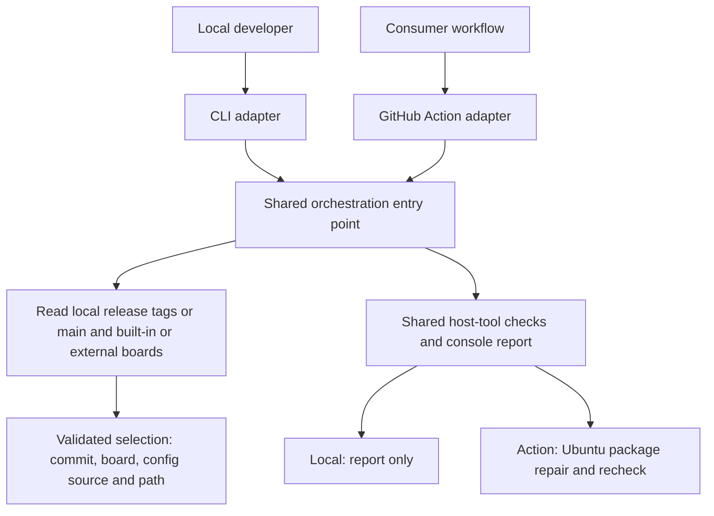
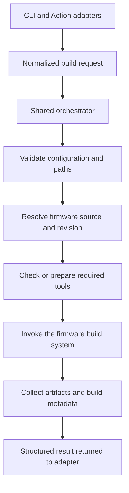

# Overall Architecture

Status: prerequisite checking, offline selection, and the Windows v0.7.12 Pico Release build are implemented; broader profiles are pending.

## Purpose and Scope

GPBuilder is a Node.js build orchestrator for GP2040-CE. It is intended to expose
the same build capabilities through a local CLI and a reusable GitHub Action.
It coordinates firmware tooling rather than replacing the firmware project's
build system or owning firmware source code.

The current implementation selects local release tags or the local `main` branch,
validates board configs, and checks host prerequisites. The CLI can build upstream
or locally sourced `v0.7.12` Pico Release firmware on the qualified Windows x64
profile, then validate and publish its UF2. Other operating systems/targets and
physical hardware behavior are not qualified. The Action's Ubuntu repair applies
to prerequisite checks; firmware builds require the same supported profile.

## Architectural Principles

- Keep observable behavior and acceptance criteria in the user-facing feature guide.
- Keep build decisions in a shared core so local and Action execution agree.
- Keep CLI arguments, GitHub inputs, logging, and exit handling in adapters.
- Make source revisions, configuration, and toolchain versions explicit enough
  to diagnose and reproduce a build.
- Prefer small modules and typed contracts; do not introduce a plugin framework,
  service, or dependency-injection container without a demonstrated need.

## Current System

| Component | Location | Current responsibility |
| --- | --- | --- |
| Shared core | [src/orchestrator.ts](../src/orchestrator.ts) | Routes selection and the supported async firmware build; requires the prerequisite gate |
| Build selection | [src/build-selection.ts](../src/build-selection.ts) | Resolves local tags or `refs/heads/main` to commits and validates built-in/external board configs without modifying checkouts |
| Prerequisites | [src/prerequisites.ts](../src/prerequisites.ts) | Detects tools, reports status, and applies the Ubuntu Action repair policy |
| CLI adapter | [src/cli.ts](../src/cli.ts) | Supplies console logging and maps failures to a nonzero exit code |
| Action adapter | [src/action.ts](../src/action.ts) | Supplies Actions logging and reports failures with `core.setFailed` |
| Action metadata | [action.yml](../action.yml) | Declares Node.js 24, operation/build inputs, and discovery/build outputs |
| Build and checks | [package.json](../package.json) | Defines npm scripts and dependencies |
| Smoke tests | [test/smoke.test.mjs](../test/smoke.test.mjs) | Executes standalone copies of both bundles from temporary directories |
| CI | [.github/workflows/ci.yml](../.github/workflows/ci.yml) | Tests on Linux, Windows, and macOS; verifies bundles; invokes the real Action on Linux |

The core accepts an explicit operation and local/Action mode plus a logging
function; it does not import the Actions toolkit. Command execution and host
information are injectable for deterministic tests. The CLI cannot enable
installation merely by inheriting GitHub environment variables.

## Runtime and Distribution

- Node.js 24 is the supported application runtime. TypeScript uses strict checks.
- npm and the committed lockfile manage dependencies. `npm ci` installs the
  locked dependency tree.
- esbuild produces standalone CommonJS bundles for the CLI and Action.
- `npm start` rebuilds and launches the CLI. Action consumers execute the
  committed bundle without installing this project's dependencies.
- The JavaScript Action is distributed through Git refs and GitHub releases;
  Marketplace listing is optional. The npm package is currently private.
- CI is configured to test the scaffold on three operating systems. This does not establish
  cross-platform support for GP2040-CE toolchains or firmware builds.

Generated [dist/action.cjs](../dist/action.cjs) and
[dist/cli.cjs](../dist/cli.cjs) are release inputs and must remain tracked.
Changes to source or dependencies must include regenerated bundles. CI rejects
differences between committed bundles and fresh build output.

## Proposed Build Architecture

The following boundaries guide future feature specs; they are not implemented
APIs or a requirement to create a module for each box immediately.

### Responsibilities and Contracts

The adapters should translate their inputs into the same typed request and map
the shared result into CLI output or Action outputs. Core behavior should not
depend on GitHub environment variables or change merely because it runs in CI.

The shared orchestrator should validate the request, sequence build steps, and
return a result. Firmware source handling, tool discovery, process execution,
and artifact collection should be isolated where they introduce external effects
or need independent tests. Prefer Node.js standard APIs and existing dependencies
before adding new libraries.

Feature guides define request fields, defaults, path resolution, supported targets,
result fields, and failure behavior as their specification. The current flags and
Action inputs are documented in [Checking Build Prerequisites](prerequisites.md)
and [Selecting a Release and Board](build-selection.md). That guide distinguishes
current local selection from the [planned CLI contract](build-selection.md#planned-cli-contract):
short/long aliases, optional source paths with an upstream default, and build type.
[Building a Flashable Pico UF2](firmware-build.md) defines the first two-flag build,
source/SDK preparation, stage boundaries, artifact validation, and qualification
gates for Pico at v0.7.12. The [matrix guide](matrix.md) defines shared YAML/JSON
defaults and board entries. Matrix execution policy and broader build profiles
remain undecided. Planned documentation does not imply runtime support.

Planned builds resolve a tag or explicit `main` to one commit before deriving the
SDK/tool requirements. A minimal bootstrap gate allows read-only source inspection;
the full revision-specific gate precedes dependency setup and compilation. Both
adapters and all boards in a matrix use that resolved source/profile, rather than
global latest-version assumptions. Main results retain their full commit identity.

### Execution and Safety

Future process execution should pass executable arguments separately instead of
interpolating user-controlled shell commands. It must propagate build failures,
make relevant diagnostics available, and specify timeout and cancellation behavior.
Build success must reflect successful compilation and validated expected artifacts,
not merely successful process launch.

Operations must not delete or overwrite caller-owned source or output without
explicit authorization. Cleanup should be restricted to directories owned by the
current build. Specs for fetching or executing external tools must address source
trust, version selection, and integrity verification. Building firmware executes
code from that source and therefore requires an appropriate trust boundary.

Avoid logging secrets. Action permissions should remain minimal, with publishing
and other write operations owned by consumer workflows unless a later spec
explicitly adds them to GPBuilder.

### Files and Reproducibility

Dependencies, caches, test coverage, logs, local environment files, and temporary
build output do not belong in version control. The root `build/`, `artifacts/`,
and `tmp/` directories are ignored for local use. The planned Pico build uses
owned OS-temporary run directories and publishes validated results under
`artifacts/`, as defined in its guide. Preserve the lockfile, documentation, and Action bundles.

A future build result should identify the resolved firmware revision, selected
target and options, toolchain versions, and produced artifacts. The Pico guide
defines first-slice naming, hashing, and metadata requirements. Shared cache keys
and reproducibility guarantees remain future work; the scaffold makes no
byte-for-byte reproducibility guarantee.

## Spec-Driven Development

Feature documents double as user documentation and specifications. Keep one
guide per feature directly in `docs/`, with a descriptive name such as
[prerequisites.md](prerequisites.md); do not create a parallel `docs/specs/` tree.

Start with the user's workflow: runnable commands, inputs/defaults, expected
output, errors/exit codes, supported platforms, side effects, and troubleshooting.
Include scope and limitations so proposed behavior cannot be mistaken for an
available capability. End with acceptance criteria and verification instructions
that developers can use to test the documented contract.

Draft or update the guide as behavior is designed, then implement and test against
it in the same change. Resolve blocking decisions with the maintainer, but do not
require a separate spec approval document or duplicate content. Keep guides current
when behavior changes and link them from the README.

Run `npm run check` and any feature-specific integration checks. Review tests
against the documented acceptance criteria, include regenerated bundles, and
state verification gaps honestly. Update this architecture document when shared
boundaries change. CI enforces technical checks, not documentation approval.

## Decisions Left to Feature Specs

- Build profiles beyond the Pico v0.7.12 example, including external-config integration.
- Compatibility decisions if the sample's SDK/compiler/Node qualification fails.
- Containerized builds and additional supported host/toolchain combinations.
- Shared caching and batch scheduling beyond isolated single-build runs.
- Matrix execution limits, scheduling, failure policy, and associated Action outputs.
- Additional build outputs and any machine-readable result format beyond selection.

These decisions should be grounded in the firmware project's build requirements
when the first build feature is specified, rather than assumed by this scaffold.